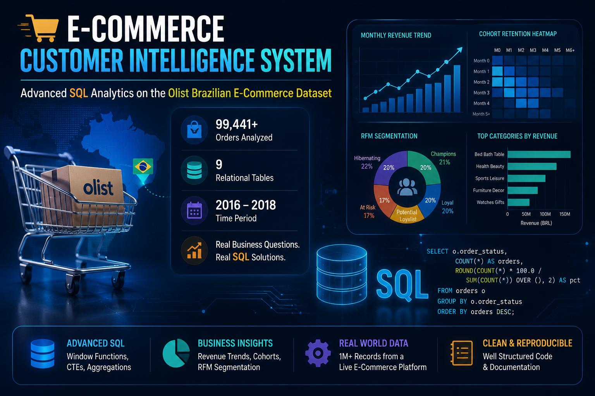

# 🛒 E-Commerce Customer Intelligence System
### Advanced SQL Analytics on the Olist Brazilian E-Commerce Dataset



---

## 📌 Overview

This project analyzes **99,441 orders** across **9 relational tables** from a real-world 
Brazilian e-commerce platform using SQL Server. The goal is to answer three core 
business questions that every consumer company tracks: revenue growth trends, 
customer retention behavior, and which customers drive the most value — using 
advanced SQL techniques including window functions, CTEs, and cohort analysis.

**Status:** 🚧 In Progress — Schema design and exploratory analysis complete. 
Revenue trend, cohort retention, and RFM segmentation modules coming next.

---

## 🗃️ Dataset

- **Source:** Kaggle — [Olist Brazilian E-Commerce Dataset](https://www.kaggle.com/datasets/olistbr/brazilian-ecommerce)
- **Size:** 99,441 orders | 9 relational tables | 1M+ total records
- **Time Period:** 2016 – 2018
- **Tables:** customers, orders, order_items, order_payments, order_reviews, 
  products, sellers, geolocation, product_category_name_translation

---

## 🛠️ Tools Used

- SQL Server Management Studio (SSMS)
- T-SQL (Microsoft SQL Server)
- Excel (for visualization and pivot tables)

---

## 📂 Schema

All 9 tables were loaded with explicit data types — decimal precision for 
monetary columns, text storage for zip codes to preserve leading zeros, and 
appropriate nullability for fields like delivery dates that don't apply to 
cancelled orders. Full reasoning documented in [`schema/schema_notes.md`](schema/schema_notes.md).

```sql
CREATE TABLE orders (
    order_id                       NVARCHAR(50)  NOT NULL PRIMARY KEY,
    customer_id                    NVARCHAR(50)  NOT NULL,
    order_status                   NVARCHAR(50)  NOT NULL,
    order_purchase_timestamp       DATETIME2(7)  NOT NULL,
    order_delivered_customer_date  DATETIME2(7)  NULL
);
```

Full schema: [`schema/01_create_tables.sql`](schema/01_create_tables.sql)

---

## 🔍 Exploratory Data Analysis

Before building any analytical modules, ran exploratory queries to validate data 
quality and understand the dataset's shape — order status distribution, revenue 
baseline, top product categories, and geographic concentration.

```sql
SELECT order_status,
    COUNT(*) AS count,
    ROUND(COUNT(*) * 100.0 / SUM(COUNT(*)) OVER (), 2) AS pct
FROM orders
GROUP BY order_status
ORDER BY count DESC;
```

Full EDA queries: [`queries/02_eda_queries.sql`](queries/02_eda_queries.sql)

---

## 📊 Analysis Modules (Coming Next)

### 1️⃣ Month-over-Month Revenue Trend Analysis
**Status:** 🚧 Not started — will use `LAG()` window functions to calculate 
period-over-period revenue growth.

### 2️⃣ Customer Cohort Retention Analysis
**Status:** 🚧 Not started — will track repeat purchase behavior across 
acquisition cohorts using `DATEDIFF()`.

### 3️⃣ RFM Customer Segmentation
**Status:** 🚧 Not started — will score customers using `NTILE(5)` window 
functions and segment using `CASE WHEN` logic.

---

## 🧠 SQL Concepts Used So Far

- Table schema design with explicit data types and constraints
- Window Functions — `SUM() OVER()`
- Aggregate functions — `COUNT`, `SUM`, `AVG`, `ROUND`
- Multi-table JOINs

---

## 📁 Repository Structure

data/
olist_dataset.zip          -- raw CSV files from Kaggle

schema/
01_create_tables.sql       -- table definitions with explicit data types
schema_notes.md            -- reasoning behind schema decisions

queries/
02_eda_queries.sql         -- exploratory analysis

---

## 🙋 About Me

Economics student at Hansraj College, University of Delhi, currently interning 
in Market Research at Taggd.

📧 [singh.arman@outlook.in]
🔗 [LinkedIn](www.linkedin.com/in/arman-singh)